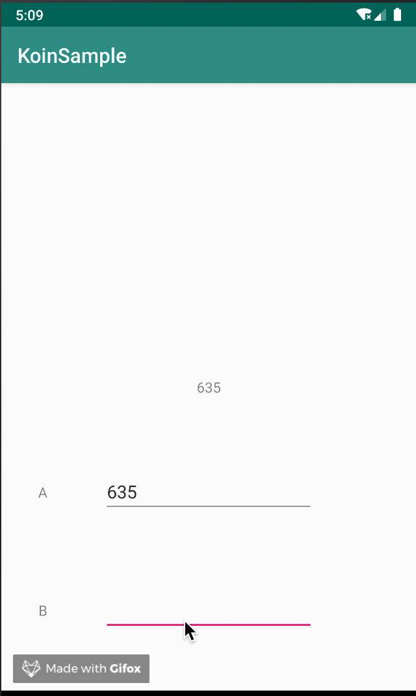

# Koin Sample

This is an Android project sample using DI(Dependency Injection) library Koin.

Consists MVVM + LiveData + DataBinding.



# Environment

- Android Studio 3.5
- Kotlin 1.3.50
- Koin 2.0.1

# Usage


```
$git clone https://github.com/ticktakclock/KoinSample.git
```

Open project and build project.